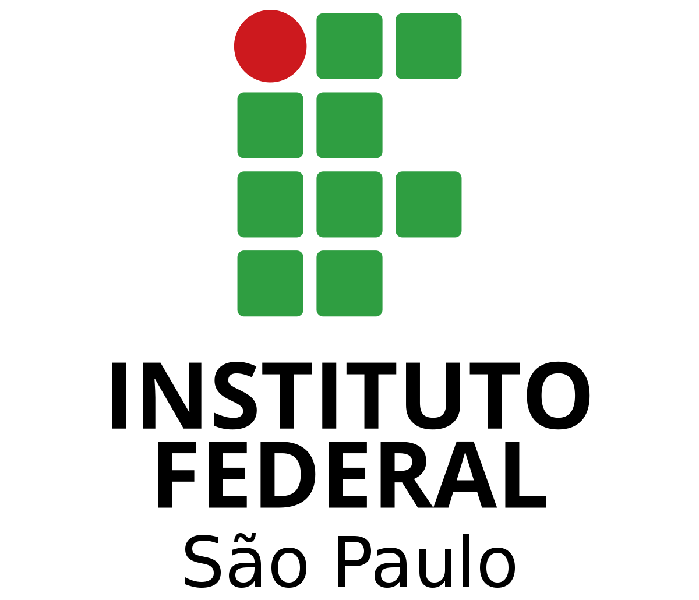

# BusinessIA-PI 🌐🚀
<link rel="stylesheet" href="https://cdnjs.cloudflare.com/ajax/libs/font-awesome/6.1.0/css/all.min.css">
<h1 align="center">
  
</h1>

# Projeto de Desenvolvimento Web - Business.IA

<h1 align="center">
  <a href="https://6546b8a8ffce14594668e39b--sprightly-pothos-2f8718.netlify.app/">website view </a>
</h1>

## Informações Gerais

<!-- Informações do curso de professor -->

 

Trabalho apresentado na matéria de Desenvolvimento Web I
                do curso Superior de Tecnologia em Análise e
                Desenvolvimento de Sistemas do Instituto Federal de
                Educação, Ciência e Tecnologia de São Paulo.
                Orientador: Prof. Wendel Marcos dos Santos 
        

<!-- Redirecionamento de para redes sociais com Icones -->
 
   
   
  

 
<!-- Redirecionamento de para redes sociais Redirecionamento -->

  <a  href="https://www.linkedin.com/in/wendelmarcosdossantos/" style="text-decoration: none;">
      
          Wendel Marcos 
     
  </a>

 
<!--****************************************************************************************************************-->
<!-- Informações do Aluno -->

 
 
Gabriel Josué de Jesus Alves (Matrícula: SP3110389) é estudante do Instituto Federal de São Paulo no curso de Tecnologia em Análise e Desenvolvimento de Sistemas, com orientação do Prof. Wendel Marcos em São Paulo, com início do projeto em 2023.
        

<!-- Redirecionamento de para redes sociais com Icones -->
 
   
   
  
  

 
<!-- Redirecionamento de para redes sociais Redirecionamento -->

   <a href="https://www.linkedin.com/in/gabrielalv3s/">
    
       Gabriel Josué 
    
  </a>

<!--****************************************************************************************************************-->

---
## Tecnologias

    
    
    
    
     
    Além dessas tecnologias, estamos abertos a explorar outras linguagens e ferramentas à medida que o projeto avança. A inovação e a adaptação são fundamentais para nosso sucesso. 💡

## Descrição do Projeto

Este projeto, desenvolvido na disciplina de Desenvolvimento Web I, tem como objetivo criar um website especializado para atender às necessidades da Business.IA, uma empresa focada em melhorar o atendimento no e-commerce e ajudar empreendedores que buscam soluções ágeis.

O website visa facilitar a compra de produtos desejados e, ao mesmo tempo, oferecer suporte eficaz na resolução de dúvidas dos clientes. Tudo isso é alcançado por meio de uma combinação de tecnologias avançadas, como **Inteligência Artificial** e **Análise de Dados**, alinhadas com **Estratégias de Marketing**.

A Business.IA, que começou como um projeto acadêmico, está em processo de lançamento como uma startup, e este projeto de Desenvolvimento Web I desempenha um papel fundamental nessa jornada, contribuindo para a criação de um website que reflete a visão e os objetivos da empresa. 🛒🤖

<a href="https://drive.google.com/file/d/1UBcM8Y85_XLCzrGDgVAndn3mWEvm9apA/view?usp=sharing">Documentação </a>

| Público-Alvo 
  
 O Business.IA pretende alcançar:
- Grupo de Pessoas: Empresas e Empreendedores
- Localização Geográfica: Brasil
- Interesses: **Dados** e Estratégias de **Marketing** 🌍🎯

## Mapa do Site e Wireframes

-   [Doc. Mapa e Wiframe <i class="fas fa-arrow-right" width="30" height="20" style="transform: rotate(-5deg);"></i>](https://drive.google.com/file/d/1UBcM8Y85_XLCzrGDgVAndn3mWEvm9apA/view?usp=sharing) 

## Como Contribuir

Se desejar contribuir para este projeto, siga estas etapas:

1. Faça um fork do repositório.
2. Crie uma branch para sua contribuição: `git checkout -b minha-contribuicao`
3. Faça as alterações desejadas.
4. Faça o commit de suas alterações: `git commit -m "Minha contribuição"`
5. Envie suas alterações para o repositório: `git push origin https://github.com/GabrielAlvesGit/BusinessIA-PI.git`
6. Abra um Pull Request para revisão. 📚🤝

## Licença

Este projeto é licenciado sob os seguintes termos:

**Uso Não-Comercial para Contribuições**

-   Você pode visualizar, bifurcar (fork) e contribuir para este projeto.
-   Contribuições devem ser licenciadas sob os mesmos termos.
-   Não é permitido o uso comercial deste projeto para fins lucrativos.

O objetivo é promover o uso educacional, colaborativo e apoiar a empresa Business.IA no seu lançamento como Startup.

## 💻 Layout
O design é preliminar e sujeito a ajustes à medida que o projeto avança. Estamos comprometidos em aprimorar a experiência do usuário e adaptar o design para atender às necessidades em constante evolução. Agradecemos o apoio à nossa abordagem iterativa na busca dos melhores resultados para o sucesso do projeto.

          

